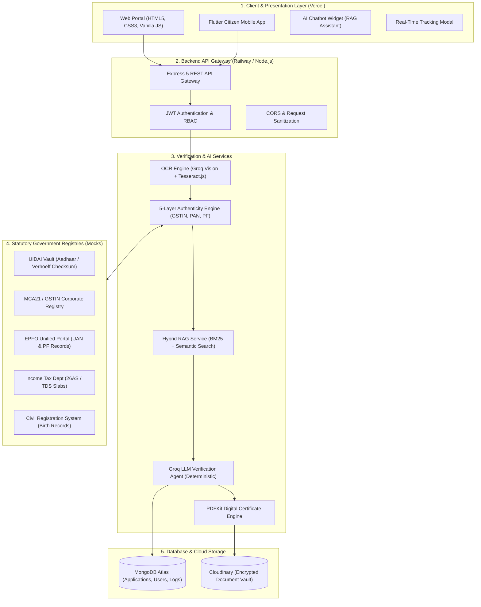
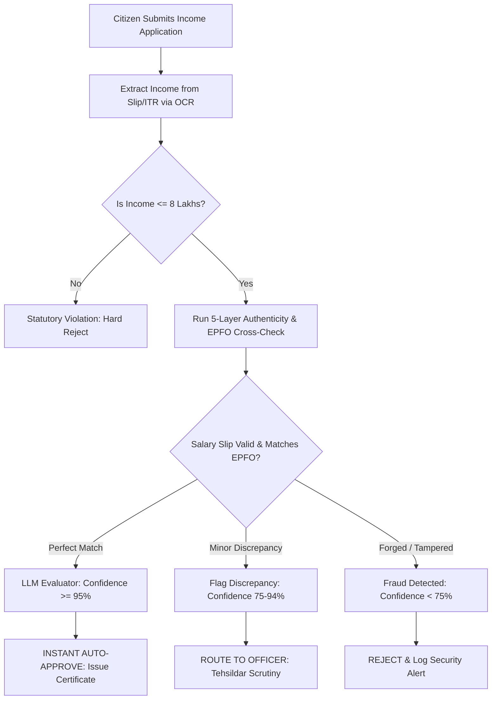
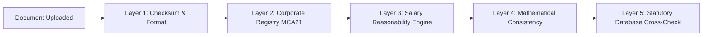

# 🏛️ GovSahayak: Complete System Architecture, Workflow & Technical Specification

> **Official Comprehensive Guide to the AI-Powered e-Governance Certificate Portal**  
> *Compliant with the Information Technology Act (2000), Registration of Births and Deaths Act (1969), and Maharashtra Land Revenue & Domicile Regulations.*

---

## 📑 Table of Contents

1. [Executive Overview & Core Vision](#1-executive-overview--core-vision)
2. [End-to-End System Architecture](#2-end-to-end-system-architecture)
3. [Technology Stack & Infrastructure](#3-technology-stack--infrastructure)
4. [Certificate 1: Income Certificate Processing & Scenarios](#4-certificate-1-income-certificate-processing--scenarios)
5. [Certificate 2: Domicile Certificate Processing & Scenarios](#5-certificate-2-domicile-certificate-processing--scenarios)
6. [Certificate 3: Birth Certificate Processing & Scenarios](#6-certificate-3-birth-certificate-processing--scenarios)
7. [The 5-Layer Document Authenticity & Anti-Fraud Engine](#7-the-5-layer-document-authenticity--anti-fraud-engine)
8. [Hybrid RAG (Retrieval-Augmented Generation) Engine](#8-hybrid-rag-retrieval-augmented-generation-engine)
9. [Mathematical Calculation of the Confidence Score](#9-mathematical-calculation-of-the-confidence-score)
10. [Three-Tier Decision Matrix (Auto-Approve / Officer Review / Reject)](#10-three-tier-decision-matrix)
11. [Revenue Officer Workflow & Audit Trail](#11-revenue-officer-workflow--audit-trail)
12. [Digitally Signed Certificate Generation & QR Verification](#12-digitally-signed-certificate-generation--qr-verification)
13. [Deployment Topology & Cloud Configuration](#13-deployment-topology--cloud-configuration)

---

## 1. Executive Overview & Core Vision

**GovSahayak** is a state-of-the-art digital public infrastructure platform engineered to automate the issuance of statutory government certificates in India. In traditional government administration, citizens wait 15 to 45 days, make multiple physical visits to Taluka/Tehsildar offices, and navigate bureaucratic delays.

GovSahayak eliminates this friction through:
* **Zero-Hallucination AI Legal Verification**: Powered by deterministic Large Language Models (temperature = 0) grounded strictly in official Government Resolutions (GRs), Gazette notifications, and statutory Acts.
* **5-Layer Anti-Fraud Detection**: Mathematical checksum verification (Verhoeff & GSTIN algorithms), employer corporate master cross-referencing (MCA21), and tax/salary consistency analysis.
* **Instant Auto-Approval (< 60 Seconds)**: Applications meeting all statutory standards with $\ge 95\%$ confidence receive a digitally signed, QR-verifiable certificate immediately.
* **Human-in-the-Loop Officer Oversight**: Borderline or flagged applications are automatically escalated to designated Revenue Officers with pre-calculated risk scores and legal citations.

---

## 2. End-to-End System Architecture



---

## 3. Technology Stack & Infrastructure

| Component | Technology | Purpose & Implementation Details |
| :--- | :--- | :--- |
| **Frontend Portal** | HTML5, Modern Vanilla CSS, ES6+ JavaScript | Zero external bundle bloat, glassmorphism design system, responsive down to 320px, state preservation via `localStorage`. |
| **Mobile Client** | Flutter / Dart | Cross-platform citizen mobile app sharing identical REST API endpoints. |
| **Backend Runtime** | Node.js 20+ / Express 5 | High-throughput asynchronous event-driven REST API listening on `0.0.0.0` for cloud container routing. |
| **Container Engine** | Railway Nixpacks | Automated containerization, isolated build environments, auto-healing with healthcheck `/health`. |
| **Primary Database** | MongoDB Atlas (Mongoose 9 ODM) | Document storage for applications, user credentials, document metadata, and officer audit logs. |
| **Object Storage** | Cloudinary & Multer-Storage-Cloudinary | Cloud storage for uploaded Aadhaar, salary slips, land records, and generated PDF certificates. |
| **LLM & Inference** | Groq Cloud SDK (`llama-3.3-70b-versatile` / `qwen3.8-27b`) | Sub-second inference latency, temperature `0` for strict deterministic compliance auditing. |
| **Vision OCR** | Groq Vision + Tesseract.js (Local Fallback) | Dual OCR pipeline extracting structured key-value data from complex, low-resolution scanned documents. |
| **Legal Retrieval (RAG)** | Custom Hybrid Search (BM25 + Cosine Similarity) | Pure in-memory chunk-level index of state Gazette rules and Central Acts. |
| **PDF Generation** | PDFKit | Vector-accurate certificate rendering with official seal, national emblem, and dynamic verification QR code. |
| **Communication** | Brevo (Sendinblue) Transactional API | Real-time OTP email delivery for registration and status change notifications. |

---

## 4. Certificate 1: Income Certificate Processing & Scenarios

### 4.1 Statutory Legal Grounding
* **Maharashtra Land Revenue Code, 1966**: Powers of the Executive Magistrate/Tehsildar to verify land and family income.
* **Central EWS Criteria (DoPT OM 36039/1/2019-Estt)**: Annual gross family income threshold of **₹8,00,000** for Economically Weaker Section eligibility.
* **Non-Creamy Layer (NCL) Regulations**: Exclusion of agricultural income vs salary computation.

### 4.2 Document Pipeline
1. **Aadhaar Card**: Identity & biometric verification.
2. **Salary Slip / Form 16 / ITR / Talathi Report**: Income proof.
3. **Self-Declaration Affidavit**: Legal oath under Section 199/200 of IPC.

### 4.3 Scenarios & Edge Cases Handled



* **Scenario A: Salaried Employee (Auto-Approve)**  
  * *Input*: Salary slip showing Gross: ₹45,000/month (Annual: ₹5,40,000). Valid GSTIN & EPF number.  
  * *System Action*: Verifies GSTIN with MCA21, cross-checks PF deduction (12% of basic), matches with EPFO registry. Income $\le$ ₹8,00,000.  
  * *Result*: **Confidence = 98% &rarr; Auto-Approved in 45 seconds**.

* **Scenario B: Discrepancy between Declared Income and Salary Slip**  
  * *Input*: Citizen declared ₹3,00,000, but OCR extraction reveals monthly gross ₹40,000 (Annual ₹4,80,000).  
  * *System Action*: Flags `INCOME_DECLARATION_MISMATCH`. Both are below ₹8 Lakhs, but discrepancy exists.  
  * *Result*: **Confidence = 82% &rarr; Escalated to Officer Review** with pre-highlighted mismatch.

* **Scenario C: Forged / Photoshopped Salary Slip**  
  * *Input*: Salary slip with basic ₹50,000, but PF deduction shown as ₹200 (violates statutory 12% EPF rule) or invalid GSTIN checksum.  
  * *System Action*: Layer 1 flags `INVALID_GSTIN_CHECKSUM`, Layer 4 flags `TAMPERED_CALCULATION`.  
  * *Result*: **Confidence = 45% &rarr; Direct Rejection** citing fraudulent document submission.

* **Scenario D: Agricultural / Daily Wage Earner (No Salary Slip)**  
  * *Input*: Uploads Gram Panchayat Income Certificate or Talathi Report.  
  * *System Action*: OCR extracts village name, circle officer stamp, and declared crop/land yield.  
  * *Result*: **Confidence = 88% &rarr; Routed to Revenue Officer** for field report validation.

---

## 5. Certificate 2: Domicile Certificate Processing & Scenarios

### 5.1 Statutory Legal Grounding
* **Maharashtra Government Resolution (GR) No. MISC-1087/CR-268/87-R-1**: Mandatory requirement of continuous residence of **not less than 15 years** in the State of Maharashtra.
* **Exempted Classes**: Wards of Central Government, Armed Forces personnel, or All India Service officers transferred into the State.

### 5.2 Document Pipeline
1. **Aadhaar Card**: Current address proof.
2. **First Evidence (Oldest Record $\ge$ 15 Years Ago)**: Primary School Leaving Certificate, 15-year-old ration card, parent's domicile, or electricity bill from $\le 2011$.
3. **Continuous Evidence**: Current utility bill or voter ID card.

### 5.3 Scenarios & Edge Cases Handled

* **Scenario A: Full 15+ Years Continuous Proof (Auto-Approve)**  
  * *Input*: School Leaving Certificate issued in 2008 + Electricity bill of 2026.  
  * *System Action*: Computes residency span: $2026 - 2008 = 18\text{ years} \ge 15\text{ years}$. Verifies 3-way name match between School Certificate, Aadhaar, and application.  
  * *Result*: **Confidence = 96% &rarr; Auto-Approved**.

* **Scenario B: Insufficient Duration (< 15 Years)**  
  * *Input*: Oldest document dated 2018 (Only 8 years residency demonstrated).  
  * *System Action*: Flags `INSUFFICIENT_RESIDENCY_DURATION`. Checks for defense/central government exemption clauses. None found.  
  * *Result*: **Confidence = 50% &rarr; Direct Rejection** citing GR Rule 2.1 (15-Year Rule).

* **Scenario C: Name Spelling Variation Across Documents**  
  * *Input*: Aadhaar says *"Sunil Ramesh Patil"*, School Certificate says *"Sunil R. Patil"*.  
  * *System Action*: Uses Levenshtein distance and token string similarity. Similarity score is $0.88 \ge 0.85$ (Partial match).  
  * *Result*: **Confidence = 85% &rarr; Sent to Officer Review** for identity confirmation.

* **Scenario D: Defense Personnel Exemption**  
  * *Input*: Residency is 4 years, but service certificate from Armed Forces Station Commander is uploaded.  
  * *System Action*: RAG retrieves Clause 3.2 (Armed Forces Personnel Exemption).  
  * *Result*: **Confidence = 91% &rarr; Sent to Officer Review** with legal citation recommending approval under the exemption quota.

---

## 6. Certificate 3: Birth Certificate Processing & Scenarios

### 6.1 Statutory Legal Grounding
* **Registration of Births and Deaths Act, 1969 (Act No. 18 of 1969)**.
* **Statutory Time Frames**:
  * **$\le$ 21 Days (Section 13(1))**: Normal registration, free of fee.
  * **21 to 30 Days (Section 13(2))**: Late registration with payment of prescribed late fee.
  * **30 Days to 1 Year (Section 13(2))**: Registration with written permission of District Registrar + Affidavit.
  * **> 1 Year (Section 13(3))**: **Delayed Registration** — strictly prohibited without an official order from a **First Class Magistrate** or **Sub-Divisional Magistrate (SDM)**.

### 6.2 Document Pipeline
1. **Hospital Discharge Card / Form 1 (Birth Report)**.
2. **Father's & Mother's Aadhaar Cards**.
3. **Marriage Certificate / Affidavit** (if institutional record missing).
4. **Magistrate Court Order** (Mandatory if delay > 365 days).

### 6.3 Scenarios & Edge Cases Handled

* **Scenario A: Normal Institutional Registration ($\le$ 21 Days)**  
  * *Input*: Birth occurred 12 days ago in District Civil Hospital. Hospital discharge summary uploaded with unique hospital registration number.  
  * *System Action*: Validates hospital code against Municipal registry, matches mother's name with Aadhaar. Time delta $\le 21\text{ days}$.  
  * *Result*: **Confidence = 99% &rarr; Auto-Approved instantly**.

* **Scenario B: Late Registration (22 to 30 Days)**  
  * *Input*: Birth occurred 27 days ago. Valid hospital proof.  
  * *System Action*: RAG cites Section 13(2). Assesses late fee condition.  
  * *Result*: **Confidence = 92% &rarr; Officer Review** for late fee verification and formal Registrar endorsement.

* **Scenario C: Delayed Registration > 1 Year (With Magistrate Order)**  
  * *Input*: Child is 4 years old. Uploads Magistrate Order from Taluka Court under Section 13(3) and parent affidavits.  
  * *System Action*: OCR reads Magistrate court seal, case number, and directive to Registrar.  
  * *Result*: **Confidence = 90% &rarr; Officer Review** for magistrate order authentication.

* **Scenario D: Delayed Registration > 1 Year (WITHOUT Magistrate Order)**  
  * *Input*: Child is 3 years old. Only uploaded hospital slip, no court order.  
  * *System Action*: Flags `MISSING_MAGISTRATE_ORDER`. Cites Section 13(3) of the Act.  
  * *Result*: **Confidence = 30% &rarr; Direct Rejection** with clear statutory instruction to obtain a Magistrate Order.

---

## 7. The 5-Layer Document Authenticity & Anti-Fraud Engine

Every document uploaded to GovSahayak passes through a multi-tier fraud detection pipeline implemented in [documentAuthenticityService.js](file:///c:/Users/chate/Desktop/LOCALREPO4%20-%20Copy/Minutes-Of--Meeting/backend/services/documentAuthenticityService.js):



### Layer 1: Format & Algorithmic Checksum Validation
* **GSTIN Validation**: Validates the 15-character structure using the official weighted Modulo 36 algorithm.
  $$\text{Checksum} = \sum_{i=0}^{13} (\text{Value}_i \times \text{Weight}_i) \pmod{36}$$
* **Aadhaar Validation**: Validates the 12-digit UID using the **Verhoeff dihedral group $D_5$ algorithm** to catch single-digit typos and adjacent transposition errors.
* **PAN Structure**: Validates 5 uppercase letters (4th letter indicates entity type: `P` for Person, `C` for Company) + 4 digits + 1 check letter.

### Layer 2: Employer Existence Verification
* Cross-references the employer name and GSTIN against corporate registry records (MCA21 master data).
* Verifies entity status: Active, Dormant, or Dissolved.

### Layer 3: Salary Reasonability & Anomaly Engine
* **Cost of Living vs Tier**: Compares declared monthly compensation against the industrial median for the specified city tier (Tier 1: Mumbai/Pune, Tier 2: Nagpur/Nashik).
* **Gross-to-Net Ratio**: Evaluates standard deduction plausibility ($0.70 \le \frac{\text{Net}}{\text{Gross}} \le 0.95$).

### Layer 4: Document Internal Mathematical Consistency
* **Annualization Test**: $\text{Monthly Gross} \times 12 \equiv \text{Annual Gross}$. Discrepancies $> 5\%$ flag `TAMPERED_CALCULATION`.
* **EPF Contribution Consistency**: Statutory Employee Provident Fund is strictly $12\%$ of Basic Salary. Slips showing gross anomalies (e.g. Basic ₹40,000 with PF ₹100) are flagged as fabricated.
* **TDS Reasonability**: Verifies that Tax Deducted at Source matches applicable Old/New tax regime slabs.

### Layer 5: Statutory Registry Cross-Referencing
* **EPFO Mock Gateway**: Reconciles the Universal Account Number (UAN) and member ID with employer establishment ID.
* **Income Tax Department Mock (Form 26AS)**: Cross-checks annual income declared on Form 16 against TDS deposited in TRACES.

---

## 8. Hybrid RAG (Retrieval-Augmented Generation) Engine

Implemented in [ragEligibilityService.js](file:///c:/Users/chate/Desktop/LOCALREPO4%20-%20Copy/Minutes-Of--Meeting/backend/services/ragEligibilityService.js), this service acts as the legal memory of GovSahayak.

### Hierarchical Knowledge Representation
Official Gazette rules are parsed into structured chunks:
$$\text{Chunk} = \{\text{Act}, \text{Chapter}, \text{Section}, \text{Clause}, \text{Text}, \text{Keywords}\}$$

### Hybrid Fusion Search Formula
For any query $Q$ and candidate policy chunk $C$, the retrieval score is:
$$\text{Score}(Q, C) = \alpha \cdot \text{Score}_{\text{BM25}}(Q, C) + (1 - \alpha) \cdot \text{Score}_{\text{Semantic}}(Q, C)$$
*(Where $\alpha = 0.40$, balancing exact statutory section matching with semantic intent).*

```
BM25 Keyword Engine           Semantic Vector Engine
(Finds exact "Section 13(3)",  (Finds "studied in village school"
 "15 years", "800000")          -> maps to Rural Residency Clause)
         \                           /
          \                         /
           ▼                       ▼
      Hybrid Score Fusion = (BM25 * 0.4) + (Semantic * 0.6)
                           |
                           ▼
             Top 5 Statutory Policy Clauses
                           |
                           ▼
           Passed to LLM Verification Agent
```

---

## 9. Mathematical Calculation of the Confidence Score

The confidence score determines whether an application is auto-approved, routed to an officer, or rejected. It is calculated deterministically via a weighted penalty and boost model:

$$\text{Confidence Score} = \min\left(100, \max\left(0, 100 - \sum \text{Penalties} + \sum \text{Boosts}\right)\right)$$

### Penalty Deductions by Severity

| Severity Level | Penalty Points | Trigger Conditions |
| :--- | :---: | :--- |
| **CRITICAL** | **-20** | Name mismatch between Aadhaar and document ($< 0.70$ similarity)<br>Fraudulent GSTIN / invalid checksum<br>Mathematical tampering on salary slip<br>Residency $< 15$ years with no exemption<br>Birth $> 1$ year without Magistrate order |
| **MODERATE** | **-10** | Partial name match ($0.70 \le \text{Similarity} < 0.85$)<br>Address district mismatch between Aadhaar and utility bill<br>Missing minor secondary document (e.g. Ration card)<br>Birth registration delayed between 21 and 30 days |
| **LOW** | **-5** | OCR confidence $< 60\%$ (blurry scan)<br>Slight discrepancy in date format<br>Employer name slight typographic variation |

### Trust Boosts Added
* **+5 Points**: Successful UIDAI Verhoeff biometric / OTP e-KYC validation.
* **+5 Points**: 100% exact match with EPFO database records.
* **+5 Points**: 100% exact match with Municipal Civil Registration birth log.

---

## 10. Three-Tier Decision Matrix

```
       Confidence Score
100% ──────────────────────────
     │
     │  AUTO-APPROVED (Instant)
     │  - Confidence >= 95%
     │  - Zero CRITICAL flags
 95% ──────────────────────────
     │
     │  OFFICER REVIEW (Human Scrutiny)
     │  - Confidence: 75% – 94%
     │  - Minor/Moderate flags present
 75% ──────────────────────────
     │
     │  DIRECT REJECT (Statutory Failure)
     │  - Confidence < 75%
     │  - Hard statutory violation
  0% ──────────────────────────
```

### 1. Auto-Approve (Confidence $\ge 95\%$)
* **Requirements**: Zero critical flags, all mandatory documents verified, strict statutory rule satisfaction.
* **Action**: Generates digitally signed PDF certificate immediately; notifies citizen via email/SMS; updates live status to `APPROVED`.

### 2. Officer Review (Confidence $75\% - 94\%$)
* **Requirements**: Identity confirmed, but moderate flags exist (e.g., partial name spelling difference, late registration fee required, agricultural income requiring field check).
* **Action**: Application moves to `UNDER_REVIEW`. Queued on the assigned Taluka Officer's portal with full AI audit guidance.

### 3. Direct Reject (Confidence $< 75\%$)
* **Requirements**: Hard statutory violation (e.g. Income $> ₹8,00,000$, Domicile duration $< 15$ years, fabricated/tampered salary slips).
* **Action**: Status set to `REJECTED`. System cites the exact Gazette Section so the citizen receives a legally grounded, auditable explanation.

---

## 11. Revenue Officer Workflow & Audit Trail

When an application requires human judgment, the designated officer accesses [portal/officer.html](file:///c:/Users/chate/Desktop/LOCALREPO4%20-%20Copy/Minutes-Of--Meeting/portal/officer.html):

```
+──────────────────────────────────────────────────────────────────────+
| 🏛️ GovSahayak Officer Scrutiny Console                              |
+──────────────────────────────────────────────────────────────────────+
| Application ID: APP-INC-2026-98124          Applicant: Rahul Sharma  |
| Certificate: Income Certificate             Risk Level: MEDIUM (82%) |
+──────────────────────────────────────────────────────────────────────+
| 🤖 AI Copilot Analysis:                                              |
|  • Warning: Declared income ₹3,00,000 vs OCR extracted ₹4,80,000     |
|  • Layer 1 Checksums: PASSED (GSTIN & PAN Valid)                     |
|  • Statutory Citation: Section 4.1 (Income Threshold <= 8 Lakhs)     |
|  • Officer Guidance: Verify whether incentive component is included  |
+──────────────────────────────────────────────────────────────────────+
| [View Uploaded Documents]    [Verify EPFO Log]    [View Tax History]  |
+──────────────────────────────────────────────────────────────────────+
| Officer Decision:                                                    |
|   [✅ Approve Certificate]    [❌ Reject Application]                 |
|   Mandatory Legal Remark: [_______________________________________]  |
+──────────────────────────────────────────────────────────────────────+
```

* **Audit Trail**: Every officer action records timestamp, Officer ID, IP address, and statutory remarks in MongoDB to maintain complete legal compliance under the Information Technology Act.

---

## 12. Digitally Signed Certificate Generation & QR Verification

Once an application is approved (automatically or via Officer endorsement):
1. **Engine**: [backend/controllers/incomeController.js](file:///c:/Users/chate/Desktop/LOCALREPO4%20-%20Copy/Minutes-Of--Meeting/backend/controllers/incomeController.js), [birthController.js](file:///c:/Users/chate/Desktop/LOCALREPO4%20-%20Copy/Minutes-Of--Meeting/backend/controllers/birthController.js), and [domicileController.js](file:///c:/Users/chate/Desktop/LOCALREPO4%20-%20Copy/Minutes-Of--Meeting/backend/controllers/domicileController.js) invoke **PDFKit**.
2. **Visual Standards**:
   * Official Government of India Ashoka Lion Capital watermark.
   * State Government Emblem & Department header.
   * Statutory legal citation (e.g. *"Issued under Section 13(1) of Act 18 of 1969"*).
   * Unique Certificate Number: `MH/INC/2026/XXXXX`.
   * Dynamic QR Code linking to the live verification endpoint:  
     `https://web-production-f9d9c.up.railway.app/api/applications/track/<ID>`
3. **Storage**: The generated PDF streams directly to Cloudinary's encrypted storage vault, returning a permanent HTTPS download URL.

---

## 13. Deployment Topology & Cloud Configuration

```
┌────────────────────────────────────────────────────────┐
│                   Vercel CDN Edge                      │
│   • Hosts: portal/ (HTML, CSS, JS)                     │
│   • Domain: https://gov-sahayak.vercel.app             │
│   • Auto-deploys from GitHub `main` branch             │
└──────────────────────────┬─────────────────────────────┘
                           │ HTTPS API Requests
                           ▼
┌────────────────────────────────────────────────────────┐
│               Railway Container Service                │
│   • Engine: Nixpacks (Node.js 20)                      │
│   • Domain: https://web-production-f9d9c.up.railway.app│
│   • Health Check: GET /health (HTTP 200)               │
│   • Network: Bound to 0.0.0.0                          │
└──────────┬───────────────────────────────┬─────────────┘
           │                               │
           ▼                               ▼
┌───────────────────────┐       ┌────────────────────────┐
│     MongoDB Atlas     │       │     Cloudinary CDN     │
│  • Database Cluster   │       │  • Document Storage    │
│  • Whitelist: 0.0.0.0 │       │  • PDF Certificate     │
│  • Mongoose 9 ODM     │       │    Distribution Vault  │
└───────────────────────┘       └────────────────────────┘
```

---

*GovSahayak — Transforming Digital Public Services through AI Integrity and Statutory Compliance.*
