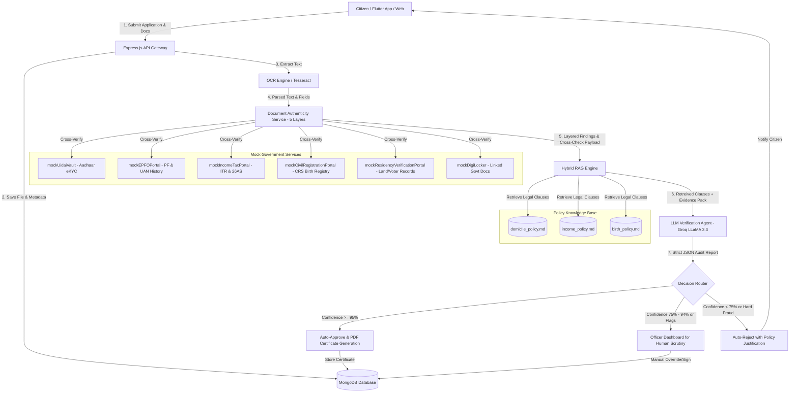
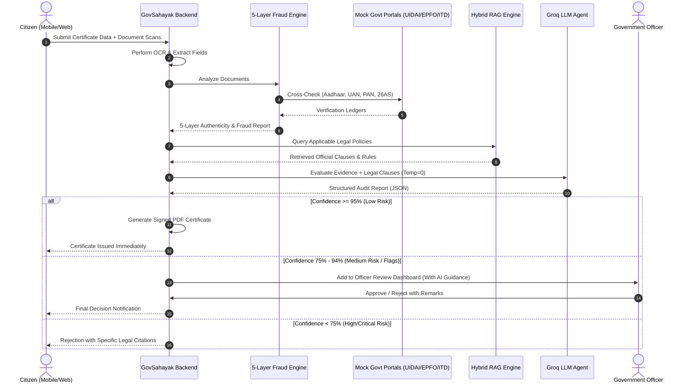

# 🏛️ GovSahayak — Unified System Architecture & Technical Documentation

**GovSahayak** is an AI-powered, zero-hallucination e-Governance automation and document verification platform built for Indian public administration workflows (specifically tailored for Maharashtra & National standards). It streamlines citizen certificate applications (Income, Domicile, Birth certificates), autonomously verifies submitted documents through OCR and 5-layer fraud detection, cross-references government registries via mock portals (UIDAI, EPFO, Income Tax, Civil Registration, DigiLocker), and makes auditable, legal-grounded decisions using a Hybrid RAG (BM25 + Semantic) + Groq LLaMA 3.3 verification agent.

---

## 📑 Table of Contents

1. [Executive Summary & Problem Statement](#1-executive-summary--problem-statement)
2. [High-Level Architecture](#2-high-level-architecture)
3. [Technology Stack](#3-technology-stack)
4. [Folder & File Structure](#4-folder--file-structure)
5. [Core Data Models (MongoDB)](#5-core-data-models-mongodb)
6. [Mock Government Portals & Integration Layer](#6-mock-government-portals--integration-layer)
   - 6.1 `mockUidaiVault.js` (Aadhaar & e-KYC Vault)
   - 6.2 `mockEPFOPortal.js` (EPFO & UAN Employment Ledger)
   - 6.3 `mockIncomeTaxPortal.js` (ITD, PAN & 26AS Tax Vault)
   - 6.4 `mockCivilRegistrationPortal.js` (CRS Birth/Death Registry)
   - 6.5 `mockResidencyVerificationPortal.js` (Tehsildar & Land Records)
   - 6.6 `mockDigiLocker.js` (Digital Document Repository)
7. [5-Layer Anti-Fraud & Document Authenticity Engine](#7-5-layer-anti-fraud--document-authenticity-engine)
8. [RAG + LLM Verification Pipeline](#8-rag--llm-verification-pipeline)
   - 8.1 Why RAG instead of Pure LLM?
   - 8.2 `ragEligibilityService.js` (BM25 + Cosine/TF-IDF Hybrid Search)
   - 8.3 `llmVerificationAgent.js` (Zero-Hallucination AI Officer)
   - 8.4 Government Policy Knowledge Base
9. [Certificate Workflows (End-to-End)](#9-certificate-workflows-end-to-end)
   - 9.1 Income Certificate Verification Flow
   - 9.2 Domicile Certificate Verification Flow
   - 9.3 Birth Certificate Verification Flow
10. [REST API Endpoints & Route Specifications](#10-rest-api-endpoints--route-specifications)
11. [Frontend Overview (Flutter Mobile/Web)](#11-frontend-overview-flutter-mobileweb)
12. [Officer Dashboard & Human-in-the-Loop Review](#12-officer-dashboard--human-in-the-loop-review)
13. [Setup, Configuration & Execution Guide](#13-setup-configuration--execution-guide)

---

## 1. Executive Summary & Problem Statement

### ❌ The Legacy Problem
Traditional government certificate issuance in India suffers from:
- **Prolonged Turnaround Times**: Manual scrutiny of salary slips, ration cards, tax returns, and utility bills takes 15 to 45 days.
- **Widespread Document Forgery**: Doctored salary slips, fake Aadhaar scans, manipulated 15-year residency proofs, and forged hospital discharge summaries often pass basic visual inspection.
- **Binary & Rigid Rule Engines**: Simple regex/if-else logic rejects valid edge cases (e.g., maiden name changes, minor OCR spelling errors, non-salaried agricultural income exemptions).
- **Officer Overload**: Government officers spend 80% of their time verifying routine, authentic applications, causing backlogs for critical cases.

### ✅ The GovSahayak Solution
- **Automated Document Extraction**: Multi-engine OCR (Tesseract + pattern parsers) extracting raw metadata, dates, amounts, and demographic markers.
- **5-Layer Fraud Detection**: Algorithmic validation (Verhoeff checksums, GSTIN structure, MCA-21 company name validation, salary-to-city cost-of-living reasonability, internal document consistency checks).
- **Simulated National Integrations**: Real-time cross-checks against mock UIDAI, Income Tax (26AS), EPFO (PF history), Civil Registration, and Land Records portals.
- **Hybrid RAG Legal Grounding**: Queries actual Government Resolutions (GRs) and legal policy documents (Maharashtra Domicile Act, Central Income Criteria, Birth & Death Registration Act 1969).
- **Zero-Hallucination AI Adjudication**: Groq LLaMA 3.3 agent operating at `temperature: 0` with strict JSON schema output, calculating a confidence score and citing exact policy sections.
- **Human-in-the-Loop Escalation**: Auto-approval for confidence $\ge 95\%$; routed to human officer dashboard with structured flags for confidence $75\%\text{--}94\%$ or critical mismatches.

---

## 2. High-Level Architecture



---

## 3. Technology Stack

| Layer | Technology / Library | Purpose |
|---|---|---|
| **Mobile & Web Client** | Flutter 3.x, Dart | Cross-platform citizen mobile app & web portal |
| **Backend Runtime** | Node.js (v18+), Express.js | Core API gateway, micro-controllers, middleware |
| **Database** | MongoDB & Mongoose ORM | Persistent storage for users, applications, documents, audit logs |
| **AI / LLM Engine** | Groq API (`llama-3.3-70b-versatile` / `llama3-70b-8192`) | High-speed, zero-hallucination legal reasoning engine |
| **RAG / Search Engine** | Pure JavaScript Custom Hybrid RAG (BM25 + TF-IDF) | Zero external vector DB dependency, instant cold starts |
| **OCR Processing** | Tesseract.js & Custom Regex Parsers | Optical character recognition on salary slips, IDs, certificates |
| **Authentication** | JWT (JSON Web Tokens), bcryptjs, Brevo (Email OTP) | Secure user/officer authentication & 2FA |
| **PDF Generation** | PDFKit / Custom Certificate Engine | Cryptographically stamped official certificate generation |
| **File Storage** | Cloudinary / Local Multi-part uploads (Multer) | Secure document asset hosting |

---

## 4. Folder & File Structure

```
Minutes-Of--Meeting/
├── backend/
│   ├── config/
│   │   ├── db.js                     # MongoDB connection setup
│   │   └── cloudinary.js             # Cloudinary upload configuration
│   ├── controllers/
│   │   ├── authController.js         # User registration, login, JWT issuance
│   │   ├── incomeController.js       # Income certificate business workflow
│   │   ├── domicileController.js     # Domicile certificate verification workflow
│   │   ├── birthController.js        # Birth certificate registration workflow
│   │   ├── officerController.js      # Officer review queue, overrides, dashboard metrics
│   │   ├── chatController.js         # Interactive citizen assistant chatbot
│   │   └── otpController.js          # Email OTP generation & verification (Brevo)
│   ├── data/
│   │   └── policies/                 # Authoritative Government Knowledge Base
│   │       ├── income_policy.md      # Creamy layer, ceiling limits, allowable deductions
│   │       ├── domicile_policy.md    # 15-year rule, education exemptions, border disputes
│   │       └── birth_policy.md       # 21-day rule, delayed registration, magistrate orders
│   ├── middleware/
│   │   ├── auth.js                   # JWT verification & role authorization (Citizen vs Officer)
│   │   └── upload.js                 # Multer disk/memory storage handler
│   ├── models/
│   │   ├── User.js                   # Citizen & Government Officer accounts
│   │   ├── Application.js            # Universal certificate application lifecycle & logs
│   │   ├── Document.js               # Document metadata, OCR text, tamper flags
│   │   ├── IncomeVerification.js     # Detailed income ledger records
│   │   ├── SalarySlip.js             # Salary breakdown (Basic, HRA, DA, PF, Deductions)
│   │   └── otp.js                    # Temporary OTP cache with TTL
│   ├── routes/
│   │   ├── authRoutes.js             # /api/auth
│   │   ├── incomeRoutes.js           # /api/income
│   │   ├── domicileRoutes.js         # /api/domicile
│   │   ├── birthRoutes.js            # /api/birth
│   │   ├── officerRoutes.js          # /api/officer
│   │   ├── chatRoutes.js             # /api/chat
│   │   └── otpRoutes.js              # /api/otp
│   ├── services/
│   │   ├── documentAuthenticityService.js # 5-layer fraud and consistency detection engine
│   │   ├── ragEligibilityService.js  # BM25 + Semantic policy search engine
│   │   ├── llmVerificationAgent.js   # Groq LLM legal adjudication agent
│   │   ├── govPolicyScraper.js       # Automated policy updater & health-checker
│   │   ├── mockUidaiVault.js         # Deterministic Aadhaar & e-KYC vault
│   │   ├── mockEPFOPortal.js         # EPFO employer & employee PF contribution database
│   │   ├── mockIncomeTaxPortal.js    # ITD PAN, 26AS, and tax filing database
│   │   ├── mockCivilRegistrationPortal.js # CRS births & deaths database
│   │   ├── mockResidencyVerificationPortal.js # Electoral & land residency history
│   │   └── mockDigiLocker.js         # Simulated DigiLocker document locker
│   └── server.js                     # Express server bootloader
└── lib/                              # Flutter Cross-Platform Frontend
    ├── core/                         # Network clients, themes, constants
    ├── models/                       # Dart data models mirroring backend entities
    ├── screens/                      # UI Views (Login, Upload, Chatbot, Officer Dashboard)
    ├── services/                     # API HTTP communication services
    └── main.dart                     # Flutter application entry point
```

---

## 5. Core Data Models (MongoDB)

### 5.1 `Application.js`
Tracks the global state of any certificate application across its entire lifecycle:
```javascript
{
  userId: { type: ObjectId, ref: 'User', required: true },
  certificateType: { 
    type: String, 
    enum: ['INCOME', 'DOMICILE', 'BIRTH', 'CASTE', 'NON_CREAMY_LAYER'], 
    required: true 
  },
  applicationNumber: { type: String, unique: true, index: true },
  status: { 
    type: String, 
    enum: ['PENDING', 'AUTO_APPROVED', 'OFFICER_REVIEW', 'APPROVED', 'REJECTED'],
    default: 'PENDING'
  },
  applicantData: {
    fullName: String,
    aadhaarNumber: String,
    panNumber: String,
    mobile: String,
    email: String,
    address: { line1: String, city: String, district: String, state: String, pincode: String },
    declaredValues: mongoose.Schema.Types.Mixed
  },
  documents: [{ type: ObjectId, ref: 'Document' }],
  verificationResults: {
    authenticityScore: Number, // 0 - 100
    overallRisk: { type: String, enum: ['LOW', 'MEDIUM', 'HIGH', 'CRITICAL'] },
    flags: [String],
    layerBreakdown: mongoose.Schema.Types.Mixed,
    mockChecks: mongoose.Schema.Types.Mixed
  },
  aiAuditReport: {
    decision: { type: String, enum: ['APPROVE', 'OFFICER_REVIEW', 'REJECT'] },
    confidence: Number, // 0 - 100
    legalCitations: [String],
    reasoning: String,
    officerGuidance: String,
    timestamp: Date
  },
  officerDecision: {
    officerId: { type: ObjectId, ref: 'User' },
    decision: String,
    remarks: String,
    decidedAt: Date
  },
  certificateUrl: String, // Cloudinary / Storage URL upon approval
  createdAt: { type: Date, default: Date.now }
}
```

---

## 6. Mock Government Portals & Integration Layer

To provide enterprise-grade real-time verification without requiring live production API credentials for restricted government portals, GovSahayak implements deterministic, algorithmically rigorous mock simulation services.

### 6.1 `mockUidaiVault.js` (Aadhaar & e-KYC)
- **Algorithm**: Implements the authentic **Verhoeff Checksum Algorithm** to validate 12-digit Aadhaar numbers immediately without network overhead.
- **Deterministic Seeding**: Converts the Aadhaar number into an algorithmic numeric seed, ensuring that querying the same Aadhaar number always yields identical, consistent demographic records (Name, Gender, DOB, Address, Linked Phone).
- **e-KYC Verification**: Supports biometric simulation, OTP match verification, and demographic fuzzy matching (Jaro-Winkler string distance).

### 6.2 `mockEPFOPortal.js` (EPFO & UAN Ledger)
- **Establishment Code Verification**: Validates employer establishment formats (`MH/BAN/0012345/000/0001234`).
- **Active Contribution Checks**: Inspects the last 6 to 24 months of PF deposits.
- **Implied Basic Wage Calculation**: Reverse-engineers basic monthly salary based on employee PF deduction:
  $$\text{Implied Basic Salary} = \frac{\text{Monthly PF Contribution}}{0.12}$$
- **Employer Existence**: Cross-checks company registration against the EPFO establishment repository.

### 6.3 `mockIncomeTaxPortal.js` (Income Tax Department / 26AS)
- **PAN Checksum & Regex**: Validates 10-character PAN structure (`[A-Z]{5}[0-9]{4}[A-Z]`), checking 4th character status ('P' for Individual, 'C' for Company, 'F' for Firm, 'H' for HUF).
- **Form 26AS Cross-Verification**: Verifies TDS deposited by employers against declared salary.
- **ITR History**: Returns 3-year historical Gross Total Income (GTI), tax paid, and ITR acknowledgement numbers.

### 6.4 `mockCivilRegistrationPortal.js` (CRS Registry)
- **Institutional Birth Verification**: Matches hospital discharge summary records with institutional birth registry databases.
- **Registration Date Checks**: Enforces Section 13 of the Registration of Births and Deaths Act (Rule: Birth registered within 21 days vs. delayed registration requiring Tehsildar or SDM order).
- **Duplicate Prevention**: Prevents issuance of duplicate birth registrations for identical parentage and birth timestamp.

### 6.5 `mockResidencyVerificationPortal.js` (Tehsildar & Land Records)
- **15-Year Continuous Residency Audit**: Evaluates multi-source proof (Voter ID entries across general elections, municipal property tax receipts, electricity billing spans).
- **Electoral Roll Ledger**: Verifies inclusion in Maharashtra assembly constituency voter rolls.
- **7/12 Land Extract Validation**: Verifies land title and ancestral domicile claims in Maharashtra rural tehsils.

### 6.6 `mockDigiLocker.js` (Digital Document Repository)
- Simulates citizen document authorization via URI lookup.
- Pulls authentic digital copies of SSC Marksheets, Driving Licenses, and Ration Cards directly from issuing authorities.

---

## 7. 5-Layer Anti-Fraud & Document Authenticity Engine

Implemented in `backend/services/documentAuthenticityService.js` (861 lines of defensive verification logic):

```
┌─────────────────────────────────────────────────────────────────────────────┐
│                       DOCUMENT AUTHENTICITY ENGINE                          │
├─────────────────────────────────────────────────────────────────────────────┤
│  Layer 1: Structural & Checksum Validation                                   │
│  • Verhoeff Checksum (Aadhaar) • PAN Regex & Type Check                      │
│  • GSTIN 15-char State/Checksum • EPFO Establishment Code Syntax            │
├─────────────────────────────────────────────────────────────────────────────┤
│  Layer 2: Corporate & Employer Existence (MCA-21 Cross-Match)               │
│  • Ministry of Corporate Affairs (MCA-21) Company Lookup                    │
│  • GSTIN vs Employer Name Correlation • Shell Company Pattern Detection      │
├─────────────────────────────────────────────────────────────────────────────┤
│  Layer 3: Salary Reasonability & Statistical Anomaly Engine                 │
│  • Job Title vs Tier-1/2/3 City Salary Benchmarks                           │
│  • Gross vs Net Take-Home vs Deductions Consistency Check                   │
├─────────────────────────────────────────────────────────────────────────────┤
│  Layer 4: Internal Document Consistency (Anti-Tampering)                     │
│  • Math Verification: Basic + HRA + Allowances - Deductions = Net           │
│  • PF Calculation Check: PF deduction == 12% of Basic                       │
│  • Tax Year / Date Period Alignment (Anti-Stale Doc Check)                  │
├─────────────────────────────────────────────────────────────────────────────┤
│  Layer 5: Cross-Portal Government Ledger Reconciliation                     │
│  • Salary Slip vs EPFO Implied Wage Cross-Check                             │
│  • Salary Slip vs Form 26AS TDS Credit Reconciliation                       │
│  • Name & Address Multi-Way Fuzzy Alignment (Aadhaar vs Utility vs Slip)   │
└─────────────────────────────────────────────────────────────────────────────┘
```

### Risk Scoring Matrix
- **Score $\ge 85$**: `LOW RISK` — Authenticity established across all layers.
- **Score $65\text{--}84$**: `MEDIUM RISK` — Minor discrepancies (e.g., minor name spelling difference, recent address shift).
- **Score $40\text{--}64$**: `HIGH RISK` — Significant mismatch (e.g., PF calculation mathematically forged, employer unregistered).
- **Score $< 40$**: `CRITICAL FRAUD` — Invalid checksums, blacklisted shell company, doctored income figures.

---

## 8. RAG + LLM Verification Pipeline

### 8.1 Why RAG instead of Pure LLM?
1. **Zero Hallucination Guarantee**: Standard LLMs often invent legal sections or apply incorrect state rules (e.g., applying Karnataka domicile rules to Maharashtra). RAG constrains the LLM to *only* cite retrieved policy clauses.
2. **Deterministic Adjudication**: Using `temperature: 0` ensures identical input documents always yield identical legal decisions.
3. **Auditability**: Every decision directly quotes the exact Chapter, Section, and Clause of the relevant Government Resolution.

### 8.2 `ragEligibilityService.js` (Hybrid Retrieval Engine)
- **Hierarchical Markdown Chunker**: Parses policy files into Section (`##`) and Sub-clause (`###`) units.
- **Hybrid Scoring Formula**:
  $$\text{Final Score} = (\text{BM25 Score} \times 0.6) + (\text{TF-IDF Cosine Similarity} \times 0.4)$$
- **Zero External Vector DB Overhead**: Written in pure Node.js—requires no external Python service, vector database, or GPU instances.
- **In-Memory Policy Indexing**: Indexed once on server startup with caching for sub-millisecond retrieval.

### 8.3 `llmVerificationAgent.js` (AI Government Officer)
- **Model**: Groq LLaMA 3.3 (`llama-3.3-70b-versatile` or `llama-3.1-8b-instant`).
- **Prompt Structure**:
  - `System Instruction`: Strictly acts as an automated Indian Administrative Officer. Prohibited from making assumptions outside the retrieved context.
  - `Context`: Relevant legal clauses retrieved by RAG.
  - `Evidence`: Structured JSON containing OCR text, 5-layer authenticity scores, and mock portal verification results.
- **Enforced JSON Output Schema**:
```json
{
  "decision": "APPROVE | OFFICER_REVIEW | REJECT",
  "confidence": 96,
  "risk_level": "LOW | MEDIUM | HIGH | CRITICAL",
  "legal_citations": [
    "Section 4.2: Maharashtra Domicile Eligibility Criteria",
    "Clause 8.1: Continuous 15-year Schooling Exemption"
  ],
  "reasoning": "Applicant has demonstrated 16 years of continuous residence through verified school leaving certificates and UIDAI address verification.",
  "flags_raised": [],
  "officer_guidance": "All criteria met. Safe for automated certificate issuance.",
  "auto_decision_possible": true
}
```

### 8.4 Decision Thresholds
| Confidence Score | Risk Level | Action Taken |
|---|---|---|
| $\ge 95\%$ | LOW | **Auto-Approved**: Certificate generated and digitally stamped instantly. |
| $75\%\text{--}94\%$ | MEDIUM | **Officer Review Queue**: Highlighted with specific flags for human sign-off. |
| $< 75\%$ | HIGH / CRITICAL | **Escalated / Rejected**: Detailed legal justification returned to applicant. |

---

## 9. Certificate Workflows (End-to-End)



### 9.1 Income Certificate Verification Flow
1. **User Input**: Declares annual family income, employer details, and uploads latest salary slip / ITR copy.
2. **Layer 1 & 2 Checks**: Validates GSTIN/PAN syntax and checks employer company validity in MCA-21 ledger.
3. **Layer 3 & 4 Checks**: Calculates $\text{Basic} + \text{HRA} + \text{Special Allowances} - \text{Deductions} = \text{Net Salary}$ and validates $\text{PF} = 12\% \text{ of Basic}$.
4. **Portal Cross-Match**: Queries `mockEPFOPortal` with applicant UAN to verify continuous monthly PF contributions.
5. **RAG Legal Check**: Retrieves `income_policy.md` clauses regarding the Rs. 8,00,000 creamy layer threshold and non-taxable agricultural exclusions.
6. **LLM Decision**: Generates audit verdict with confidence rating.

### 9.2 Domicile Certificate Verification Flow
1. **User Input**: Submits 15+ years residency claim, address history, Aadhaar card, utility bills, and school leaving certificate.
2. **Aadhaar e-KYC**: Verhoeff-verified Aadhaar checks via `mockUidaiVault.js`.
3. **Residency Verification**: Cross-references `mockResidencyVerificationPortal.js` for voter roll inclusion and municipal records spanning 15 years.
4. **RAG Legal Check**: Retrieves `domicile_policy.md` (e.g., Section 3.1: 15-year continuous domicile, Section 5: Education exemptions for central government employee wards).
5. **LLM Decision**: Validates whether documentary proof legally covers the uninterrupted 15-year threshold.

### 9.3 Birth Certificate Verification Flow
1. **User Input**: Submits child birth details (Date, Place, Hospital Name, Father & Mother Aadhaar).
2. **Hospital & CRS Check**: Cross-references institutional birth log in `mockCivilRegistrationPortal.js`.
3. **21-Day Rule Check**: Evaluates application timestamp against birth date. If $> 21$ days, checks for mandatory Tehsildar/SDM delayed registration endorsement under the RBD Act.
4. **RAG Legal Check**: Retrieves `birth_policy.md`.
5. **LLM Decision**: Confirms institutional alignment, parental identity matches, and generates certificate.

---

## 10. REST API Endpoints & Route Specifications

### Authentication (`/api/auth`)
- `POST /api/auth/register`: Register new citizen/officer account.
- `POST /api/auth/login`: Authenticate and receive JWT bearer token.
- `GET /api/auth/profile`: Get current authenticated user profile.

### OTP Service (`/api/otp`)
- `POST /api/otp/send`: Dispatch 6-digit email OTP via Brevo API.
- `POST /api/otp/verify`: Validate submitted OTP against TTL cache.

### Income Certificate (`/api/income`)
- `POST /api/income/verify-salary-slip`: Upload salary slip, run OCR, 5-layer fraud checks, and return instant validation breakdown.
- `POST /api/income/apply`: Submit formal Income Certificate application.
- `GET /api/income/status/:appId`: Check application status and view AI audit report.

### Domicile Certificate (`/api/domicile`)
- `POST /api/domicile/apply`: Submit residency documents and Aadhaar details for Domicile verification.
- `GET /api/domicile/status/:appId`: Query Domicile verification state and officer notes.

### Birth Certificate (`/api/birth`)
- `POST /api/birth/apply`: Submit birth registration details and hospital records.
- `GET /api/birth/status/:appId`: Check registration approval and download certificate.

### Officer Dashboard (`/api/officer`)
- `GET /api/officer/applications`: Get paginated queue of applications filtered by status (`OFFICER_REVIEW`, `PENDING`).
- `GET /api/officer/application/:id`: Retrieve complete audit dossier (OCR text, 5-layer risk scores, mock portal responses, AI guidance).
- `POST /api/officer/decision`: Submit manual approval/rejection with official remarks.
- `GET /api/officer/metrics`: Aggregate department statistics (Total processed, auto-approval rate, fraud catches).

### Citizen Chatbot (`/api/chat`)
- `POST /api/chat/message`: Conversational AI assistant helping citizens understand eligibility rules and required documents in natural language.

---

## 11. Frontend Overview (Flutter Mobile/Web)

The client application is built with **Flutter**, enabling a unified codebase across Android, iOS, and Web:

- **State Management & Routing**: Clean provider / service architecture with reactive state updates.
- **Citizen Portal**:
  - Guided step-by-step document upload wizard with client-side image compression and preview.
  - Real-time application tracker showing the verification stage (OCR $\rightarrow$ Portal Check $\rightarrow$ Legal Audit $\rightarrow$ Certificate Issued).
  - Built-in multi-lingual conversational chatbot.
- **Officer Scrutiny Terminal**:
  - Split-screen verification workspace: Original document scan on the left, extracted data & AI risk breakdown on the right.
  - Color-coded risk indicators (Green/Yellow/Red) highlighting exact discrepancies (e.g., *"Salary basic does not match EPFO contribution"*).
  - One-click approval with digital signature stamping.

---

## 12. Officer Dashboard & Human-in-the-Loop Review

GovSahayak adheres to the **Responsible AI in Governance** paradigm:

1. **Explainable AI (XAI)**: The AI does not output black-box scores. Every recommendation includes:
   - Specific legal citations.
   - Plain-English reasoning.
   - Concrete items for the officer to inspect (`officer_guidance`).
2. **Preserved Human Agency**: The AI agent **never** overrides human authority on ambiguous cases. Any score between 75% and 94% or containing medium risk flags is explicitly gated behind human officer approval.
3. **Comprehensive Audit Logs**: Every automated check, portal response, and officer action is immutably timestamped in MongoDB.

---

## 13. Setup, Configuration & Execution Guide

### Prerequisites
- **Node.js**: v18.0.0 or higher
- **MongoDB**: Local instance (`mongodb://localhost:27017`) or MongoDB Atlas URI
- **Groq API Key**: For ultra-fast LLM inference ([console.groq.com](https://console.groq.com))
- **Flutter SDK**: 3.x+ (for frontend)

### 1. Environment Configuration
Create a `.env` file in `backend/`:
```env
PORT=5000
MONGO_URI=mongodb://localhost:27017/govsahayak
JWT_SECRET=your_super_secret_jwt_key_here
GROQ_API_KEY=gsk_your_groq_api_key_here
BREVO_API_KEY=your_brevo_smtp_api_key_here
CLOUDINARY_CLOUD_NAME=your_cloudinary_name
CLOUDINARY_API_KEY=your_cloudinary_key
CLOUDINARY_API_SECRET=your_cloudinary_secret
```

### 2. Backend Installation & Startup
```bash
# Navigate to backend directory
cd Minutes-Of--Meeting/backend

# Install dependencies
npm install

# (Optional) Seed initial departments and officer accounts
node seedDepartments.js

# Start backend server
npm start
# Server will run on http://localhost:5000
```

### 3. Frontend Installation & Startup
```bash
# Navigate to project root
cd Minutes-Of--Meeting

# Get Flutter packages
flutter pub get

# Run on Chrome / Connected device
flutter run -d chrome
```

---

## 🏛️ Summary & Key Milestones

| Feature | Implementation Status | Tech Highlight |
|---|---|---|
| **Deterministic UIDAI Vault** | ✅ Complete | Verhoeff checksum algorithm + seed generation |
| **5-Layer Authenticity Engine** | ✅ Complete | MCA-21, 26AS, EPFO, GSTIN & Math consistency |
| **Hybrid Legal RAG Engine** | ✅ Complete | BM25 + TF-IDF, zero vector DB overhead |
| **Zero-Hallucination AI Officer** | ✅ Complete | Groq LLaMA 3.3, temp=0, strict JSON schema |
| **Tri-Certificate Workflows** | ✅ Complete | Income, Domicile, and Birth certificates |
| **Human-in-the-Loop Review** | ✅ Complete | Officer portal with XAI reasoning & guidance |

---
*GovSahayak — Transforming Public Administration with Precision, Speed, and Uncompromising Transparency.*
